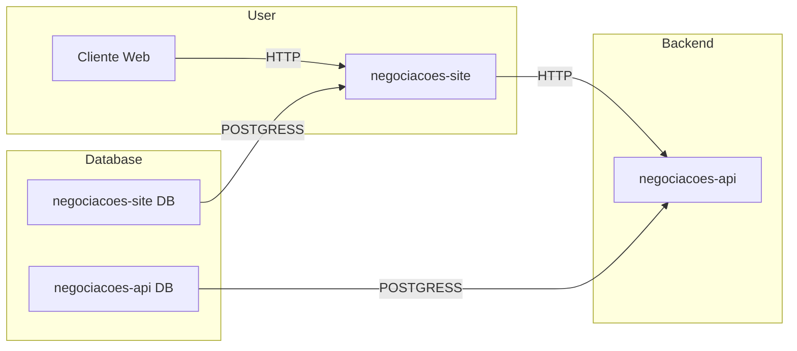

# Projeto de Estudo

 

## Motivação

Este projeto tem como objetivo atualizar a tecnologia JavaScript para TypeScript no contexto de desenvolvimento front-end (diretório `negociacoes-site`). O foco é o aprendizado e a aplicação de boas práticas utilizando TypeScript, sem o uso de frameworks como React, Vue, Nest, Next, entre outros. O projeto é baseado no curso online [TypeScript: Evoluindo seu JavaScript](https://www.alura.com.br/curso-online-typescript-evoluindo-javascript) e em trilhas de atualização.

Além disso, foi realizado o dockerização do projeto (a arquitetura original era voltada apenas para fins didáticos) para testar o [Github Codespaces](https://github.com/codespaces), uma solução que permite validar e compartilhar o projeto na nuvem durante o desenvolvimento.

Está nos planos atualizar o `negociacoes-api`, que atualmente é um mero exemplo para servir o front-end, para algo mais funcional, como uma prova de conceito (POC). Paralelamente, também estou pesquisando outras soluções para projetos de microsserviços mais complexos que estou desenvolvendo.

## Como Rodar

Para executar o projeto, siga as instruções abaixo:

1. Faça o download do projeto.
2. Certifique-se de ter o Docker Compose instalado em sua máquina.
3. Execute o comando `docker-compose up --build` ou `docker compose up --build`, dependendo da versão do Docker Compose instalada.
4. Acesse `http://localhost:3000` em seu navegador para visualizar o projeto. Ele utiliza as portas `3000` e `3001` para a execução.

## Diagrama

O diagrama abaixo ilustra a arquitetura do projeto:

Para obter mais informações, consulte o [Histórico de Versões](./CHANGELOG.md).
