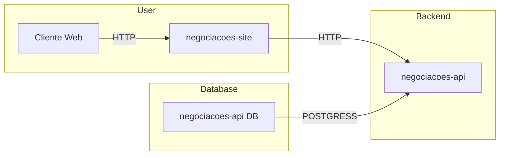

# Projeto de Estudo NodeJs e Typescript

  

---

## :arrow_heading_up: Índice
<!--ts-->
- [Projeto de Estudo NodeJs e Typescript](#projeto-de-estudo-nodejs-e-typescript)
  - [:arrow\_heading\_up: Índice](#arrow_heading_up-índice)
  - [:green\_book: Sobre](#green_book-sobre)
  - [:computer: Instalação](#computer-instalação)
  - [:bar\_chart: Diagrama](#bar_chart-diagrama)
  - [:hammer: Ferramentas](#hammer-ferramentas)
  - [:clap: Boas Práticas](#clap-boas-práticas)
  - [:1234: Versões](#1234-versões)

<!--te-->
---

## :green_book: Sobre

Este projeto tem como objetivo me atualizar em JavaScript/TypeScript no contexto de desenvolvimento front-end (diretório `negociacoes-site`). O foco é o aprendizado e a aplicação de boas práticas utilizando TypeScript, sem o uso de frameworks como React, Vue, Nest, Next, entre outros. O projeto é baseado na [Formação Melhore sua experiência de desenvolvimento com TypeScript](https://www.alura.com.br/formacao-typescript) e em trilhas de atualização.

Além disso, foi realizada dockerização do projeto (a arquitetura original era voltada apenas para fins didáticos) para testar o [Github Codespaces](https://github.com/codespaces), uma solução que permite validar e compartilhar o projeto na nuvem durante o desenvolvimento.

Está nos planos atualizar o `negociacoes-api`, que atualmente é um mero exemplo para servir o front-end, para algo mais funcional, como uma prova de conceito (POC). Paralelamente, também estou pesquisando outras soluções para projetos de microsserviços mais complexos que estou desenvolvendo.

[:arrow_heading_up: voltar](#indice)

---

## :computer: Instalação

Para executar o projeto, siga as instruções abaixo:

1. Faça o download do projeto.
2. Certifique-se de ter o Docker Compose instalado em sua máquina.
3. Execute na raiz do projeto, o comando `docker-compose up` ou `docker compose up`, dependendo da versão do Docker Compose instalada.
4. Acesse `http://localhost:3000` em seu navegador para visualizar o projeto. Ele utiliza as portas `3000` e `3001` para a execução.

[:arrow_heading_up: voltar](#indice)

---

## :bar_chart: Diagrama

O diagrama abaixo ilustra a arquitetura do projeto:

[:arrow_heading_up: voltar](#indice)

---

## :hammer: Ferramentas
As seguintes ferramentas foram usadas na construção do projeto:

- [Node.js](https://nodejs.org/en/)
- [Express](https://expressjs.com/en/)
- [TypeScript](https://www.typescriptlang.org/)
- [npm](https://www.npmjs.com/)
- [Docker](https://www.docker.com/)

[:arrow_heading_up: voltar](#indice)

---

## :clap: Boas Práticas
Seguindo boas práticas dedesenvolvimento:
- [Semantic Versioning 2.0.0](https://semver.org/spec/v2.0.0.html)
- [keep a changelog](https://keepachangelog.com/en/1.0.0/)
- [Conventional Commits](https://www.conventionalcommits.org/en/v1.0.0/)
- [Mermaid Diagrams](https://mermaid.js.org)

[:arrow_heading_up: voltar](#indice)

---

## :1234: Versões
Para obter mais informações, consulte o [Histórico de Versões](./CHANGELOG.md).

[:arrow_heading_up: voltar](#indice)

