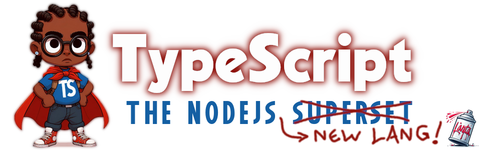
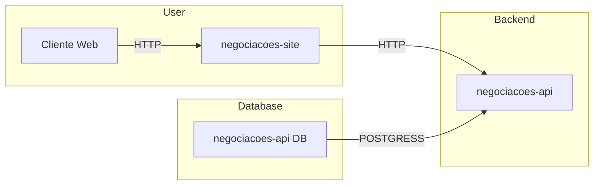

# Projeto de Estudo NodeJS e TypeScript

        <!-- icons by https://simpleicons.org/?q=types -->

 

---

### 🕸️ Redes:

     

---

## :arrow_heading_up: Índice

<!--ts-->

[Projeto de Estudo NodeJs e Typescript](#projeto-de-estudo-nodejs-e-typescript)

1.  :arrow_heading_up: [Índice](#arrow_heading_up-índice)
2.  :green_book: [Sobre](#green_book-sobre)
3.  :camera: [Imagens](#camera-imagens)
4.  :computer: [Instalação](#computer-instalação)
5.  :bar_chart: [Diagrama](#bar_chart-diagrama)
6.  :hammer: [Ferramentas](#hammer-ferramentas)
7.  :clap: [Boas Práticas](#clap-boas-práticas)
8.  :nerd_face: [Para Desenvolvedores](#nerd_face-para-desenvolvedores)
9.  :1234: [ Versões](#1234-versões)
10. :robot: [Uso de IA](#ia)

## <!--te-->

## :green_book: Sobre

Front-end de sistema de Negociações puramente didático

Este projeto tem como objetivo me atualizar em JavaScript/TypeScript no contexto de desenvolvimento front-end (diretório `packages/negociacoes-site`). O foco é o aprendizado e a aplicação de boas práticas utilizando TypeScript, sem o uso de frameworks como React, Vue, Nest, Next, entre outros. O projeto é baseado na [Formação Melhore sua experiência de desenvolvimento com TypeScript](https://www.alura.com.br/formacao-typescript) e em trilhas de atualização.

Além disso, foi realizada dockerização do projeto (a arquitetura original era voltada apenas para fins didáticos) para testar o [Github Codespaces](https://github.com/codespaces), uma solução que permite validar e compartilhar o projeto na nuvem durante o desenvolvimento.

Está nos planos atualizar o `packages/negociacoes-api`, que atualmente é um mero exemplo para servir o front-end, para algo mais funcional, como uma prova de conceito (POC). Paralelamente, também estou pesquisando outras soluções para projetos de microsserviços mais complexos que estou desenvolvendo.

[:arrow_heading_up: voltar](#indice)

---

## :camera: Imagens

 

 

 

 

[:arrow_heading_up: voltar](#indice)

---

## :computer: Instalação

Para executar o projeto, siga as instruções abaixo:

1. Faça o download/clone do repositório do projeto.
2. Certifique-se de ter o Docker Compose instalado em sua máquina.
3. Execute na raiz do projeto, o comando `docker-compose up` ou `docker compose up`, dependendo da versão do Docker Compose instalada.
4. Acesse `http://localhost:3000` em seu navegador para visualizar o projeto. Ele utiliza as portas `3000` e `3001` para a execução.

[:arrow_heading_up: voltar](#indice)

---

## :bar_chart: Diagrama

O diagrama abaixo ilustra a arquitetura do projeto:

```mermaid
graph LR

subgraph User
  A[Cliente Web] -->|HTTP| B[negociacoes-site]
end

subgraph Backend
  B -->|HTTP| C[negociacoes-api]
end

subgraph Database
  E[negociacoes-api DB] -->|POSTGRESS| C
end

```

[:arrow_heading_up: voltar](#indice)

---

## :hammer: Ferramentas

As seguintes ferramentas foram usadas na construção do projeto:

- [Node.js](https://nodejs.org/en/)
- [Express](https://expressjs.com/en/)
- [TypeScript](https://www.typescriptlang.org/)
- [npm](https://www.npmjs.com/)
- [NX](https://nx.dev/)
- [Docker](https://www.docker.com/)

[:arrow_heading_up: voltar](#indice)

---

## :clap: Boas Práticas

Seguindo boas práticas de desenvolvimento:

- [Semantic Versioning 2.0.0](https://semver.org/spec/v2.0.0.html)
- [keep a changelog](https://keepachangelog.com/en/1.0.0/)
- [Conventional Commits](https://www.conventionalcommits.org/en/v1.0.0/)
- [Mermaid Diagrams](https://mermaid.js.org)
- [Monorepo](https://monorepo.tools/)

[:arrow_heading_up: voltar](#indice)

---

## :nerd_face: Para Desenvolvedores

Durante o estudo/desenvolvimento, por sugestão de outros desenvolvedores, foram adotadas as ferramentas [Nx](https://nx.dev/) (que requer Nodejs em sua máquina) e seu [console no VScode](https://marketplace.visualstudio.com/items?itemName=nrwl.angular-console) para a gestão de Monorepos. Estou utilizando o mínimo de suas capacidades com finalidade de estudo, no entanto para uma experiência de desenvolvimento e validação técnica do repositório, [sugiro instalação do ambiente](https://docs.npmjs.com/downloading-and-installing-node-js-and-npm). Explicar o funcionamento do Nx não é o objetivo do presente documento, mas [encorajo a buscar esses dados](https://nx.dev/getting-started/intro) caso deseje. [Qualquer Monorepo pode se tornar um monorepo Nx](https://blog.nrwl.io/adding-nx-to-an-existing-monorepo-by-running-one-command-426fa519d943).

Nada do que foi discutido nessa seção deve atrapalhar o [correto funcionamento e instalação](#computer-instalação) do projeto em uma máquina com o docker-compose funcional

Tenha bons estudos :)

<!-- `npx nx dep-graph` é MARAVILHOSO -->

[:arrow_heading_up: voltar](#indice)

---

## :1234: Versões

As tags de versões estao sendo criadas manualmente a medida que os estudos avançam com melhorias notáveis no projeto. Cada novo modulo do curso ou funcionalidade é desenvolvido em uma branch a parte quando finalizadas é gerada tag (minor para o curso e patch para melhorias) e mergeadas em master.

Com a adição do Nx e futuramente um script de controle de versão esse processo tende a ser automatizado

Para obter mais informações, consulte o [Histórico de Versões](./CHANGELOG.md).

[:arrow_heading_up: voltar](#indice)

---

### :robot: Uso de IA:

O cabeçalho desta página foi criado com auxílio de inteligência artificial e um mínimo de 
retoque e construção no Gimp 

__Foram utilizados os seguintes prompts para sua criação no [Bing IA:](https://www.bing.com/images/create/)__

  
<b>Jovem Super-herói TS</b>

<i>"menino negro estilo cartoon com cabelo de trancas nago e oculos redondos de armacao grossa de frente calca jeans, tenis estilo all star vermelhos e camisa azul escrito as letras "TS" olhar confiante para frente e com uma capa vermelha de super heroi improvisada amarrada em seu pescoco como se estivesse brincando de ser o super homem mas ao inves do S esta escrito TS em branco"<b>(sic)</b></i>

  
<b>Lata de Spray</b>

<i>"lata de spray de pichacao em estilo cartoon branca mas com gotas de tinta vermelha escorrendo pelo ejetor de tinta, fundo totalmente branco"<b>(sic)</b></i>

 

IA também é utilizada em minhas pesquisas e estudos como ferramenta de apoio; no entanto, __artes e desenvolvimento são, sobretudo, atividades criativas humanas.__

Contrate artistas para projetos comerciais ou mais elaborados e Aprenda Engenhosidade!

[:arrow_heading_up: voltar](#indice)

<!--

-->
