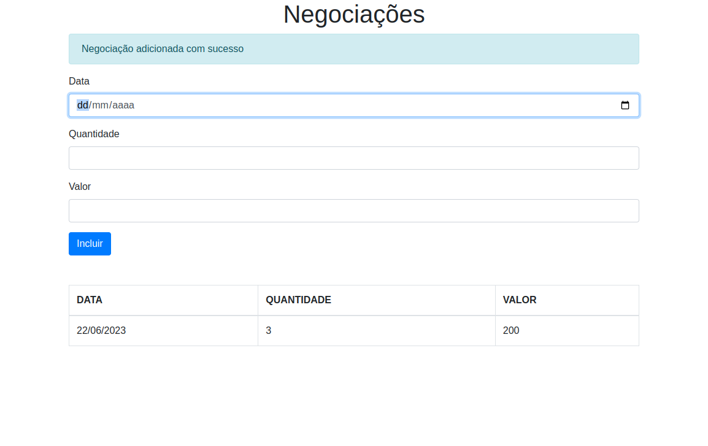

# Projeto de Estudo NodeJs e Typescript

  

---

## :arrow_heading_up: Índice
<!--ts-->
- [Projeto de Estudo NodeJs e Typescript](#projeto-de-estudo-nodejs-e-typescript)
  - [:arrow\_heading\_up: Índice](#arrow_heading_up-índice)
  - [:green\_book: Sobre](#green_book-sobre)
  - [:camera: Imagens](#camera-imagens)
  - [:computer: Instalação](#computer-instalação)
  - [:bar\_chart: Diagrama](#bar_chart-diagrama)
  - [:hammer: Ferramentas](#hammer-ferramentas)
  - [:clap: Boas Práticas](#clap-boas-práticas)
  - [:nerd\_face: Para Desenvolvedores](#nerd_face-para-desenvolvedores)
  - [:1234: Versões](#1234-versões)

<!--te-->
---

## :green_book: Sobre

Este projeto tem como objetivo me atualizar em JavaScript/TypeScript no contexto de desenvolvimento front-end (diretório `negociacoes-site`). O foco é o aprendizado e a aplicação de boas práticas utilizando TypeScript, sem o uso de frameworks como React, Vue, Nest, Next, entre outros. O projeto é baseado na [Formação Melhore sua experiência de desenvolvimento com TypeScript](https://www.alura.com.br/formacao-typescript) e em trilhas de atualização.

Além disso, foi realizada dockerização do projeto (a arquitetura original era voltada apenas para fins didáticos) para testar o [Github Codespaces](https://github.com/codespaces), uma solução que permite validar e compartilhar o projeto na nuvem durante o desenvolvimento.

Está nos planos atualizar o `negociacoes-api`, que atualmente é um mero exemplo para servir o front-end, para algo mais funcional, como uma prova de conceito (POC). Paralelamente, também estou pesquisando outras soluções para projetos de microsserviços mais complexos que estou desenvolvendo.

[:arrow_heading_up: voltar](#indice)

---

## :camera: Imagens

  
Projeto rodando local

 

 

  
NX dep graph

 

 

[:arrow_heading_up: voltar](#indice)

---

## :computer: Instalação

Para executar o projeto, siga as instruções abaixo:

1. Faça o download/clone do repositório do projeto.
2. Certifique-se de ter o Docker Compose instalado em sua máquina.
3. Execute na raiz do projeto, o comando `docker-compose up` ou `docker compose up`, dependendo da versão do Docker Compose instalada.
4. Acesse `http://localhost:3000` em seu navegador para visualizar o projeto. Ele utiliza as portas `3000` e `3001` para a execução.

[:arrow_heading_up: voltar](#indice)

---

## :bar_chart: Diagrama

O diagrama abaixo ilustra a arquitetura do projeto:

[:arrow_heading_up: voltar](#indice)

---

## :hammer: Ferramentas
As seguintes ferramentas foram usadas na construção do projeto:

- [Node.js](https://nodejs.org/en/)
- [Express](https://expressjs.com/en/)
- [TypeScript](https://www.typescriptlang.org/)
- [npm](https://www.npmjs.com/)
- [NX](https://nx.dev/)
- [Docker](https://www.docker.com/)

[:arrow_heading_up: voltar](#indice)

---

## :clap: Boas Práticas
Seguindo boas práticas dedesenvolvimento:
- [Semantic Versioning 2.0.0](https://semver.org/spec/v2.0.0.html)
- [keep a changelog](https://keepachangelog.com/en/1.0.0/)
- [Conventional Commits](https://www.conventionalcommits.org/en/v1.0.0/)
- [Mermaid Diagrams](https://mermaid.js.org)
- [Monorepo](https://monorepo.tools/)

[:arrow_heading_up: voltar](#indice)

---

## :nerd_face: Para Desenvolvedores
Durante o estudo/desenvolvimento, por sugestão de outros desenvolvedores, foram adotadas as ferramentas [Nx](https://nx.dev/) e seu [console no VScode](https://marketplace.visualstudio.com/items?itemName=nrwl.angular-console) para a gestão de Monorepos. Estou utilizando o mínimo de suas capacidades com finalidade de estudo, no entanto para uma experiência de desenvolvimento e validação técnica do repositório, [sugiro instalação do ambiente](https://nx.dev/recipes/adopting-nx/adding-to-monorepo). Explicar o funcionamento do Nx não é o objetivo do presente documento, mas encorajo a buscar esses dados caso deseje. [Qualquer Monorepo pode se tornar um monorepo Nx](https://blog.nrwl.io/adding-nx-to-an-existing-monorepo-by-running-one-command-426fa519d943).

Nada do que foi discutido nessa seção deve atrapalhar o [correto funcionamento e instalação](#computer-instalação) do projeto em uma máquina com o docker-compose funcional

Tenha bons estudos :)
<!-- `npx nx dep-graph` é MARAVILHOSO -->
[:arrow_heading_up: voltar](#indice)

---

## :1234: Versões
As versões estao sendo criadas manualmente a medida que os estudos avançam com melhorias notáveis no projeto. Cada novo modulo do curso ou funcionalidade é desenvolvido em uma branch a parte quando finalizadas é gerada tag (minor para o curso e patch para melhorias) e mergeadas em master.

Com a adição do Nx e futuramente um script de controle de versão esse processo tende a ser automatizado

Para obter mais informações, consulte o [Histórico de Versões](./CHANGELOG.md).

[:arrow_heading_up: voltar](#indice)

